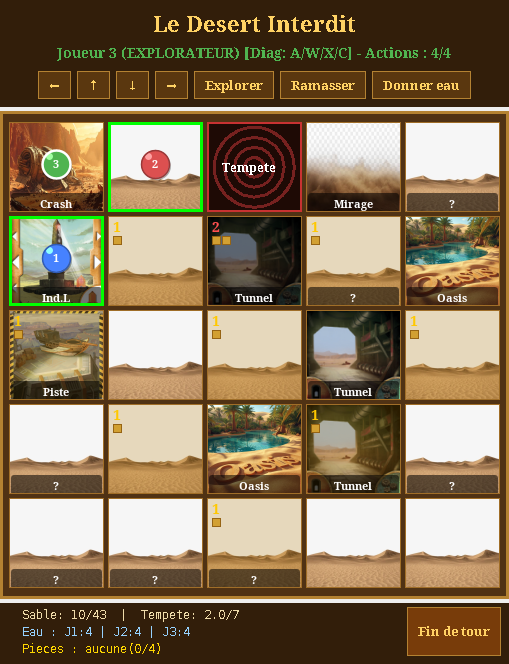
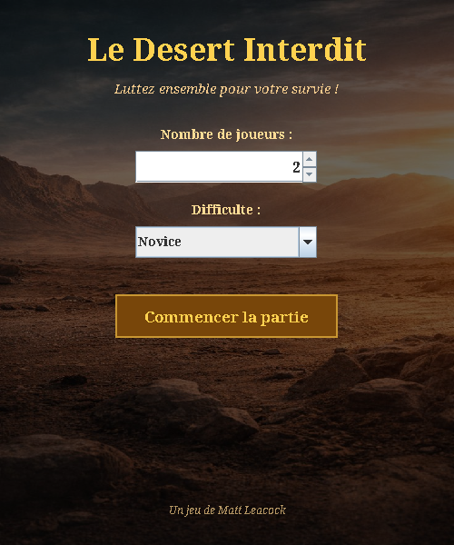
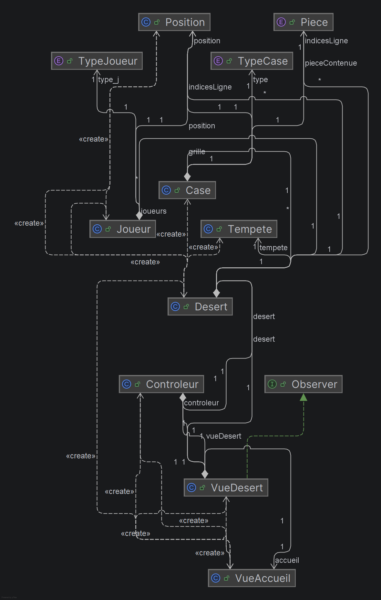

# Forbidden Desert — Java / Swing

[](https://github.com/ia-maiga/forbidden-desert-java/actions/workflows/ci.yml)

> A playable desktop version of the cooperative board game **Forbidden Desert** (*Le Désert
> Interdit*, by Matt Leacock), written in **Java** with a **Swing** interface and a strict
> **Model-View-Controller** architecture.

Team project for the *Object-Oriented Programming & Software Engineering* course (POGL, LDD2,
**Université Paris-Saclay**, 2025-2026).

<p align="center">
  
  &nbsp;
  
</p>

---

## 🎲 The game

2 to 5 players crash in the desert. Together, they must find the **4 pieces of a flying
machine** and take off from the launch pad, before they **die of thirst** or the desert is
**buried under sand**.

Each turn, a player has **4 actions**: move, dig sand, explore a tile, pick up a piece, or give
water to a teammate. Then the **storm** plays: it moves tiles around, adds sand, causes heat
waves (everyone drinks) or gets stronger.

**Implemented**
- 5×5 board with randomly placed tiles, the storm's eye, and the initial sand pattern
- Storm actions: wind with direction and strength, heat waves, storm intensifying
- Sand: blocked tiles (≥ 2 sand), stuck players must dig first
- Water: canteens, oasis and mirage tiles, tunnels (shelter + teleportation), giving water
- Clues: discovering the row clue and the column clue of a piece reveals where it is
- Victory (4 pieces + everyone on a clear launch pad) and 3 ways to lose
- Special roles: **Archaeologist** (digs 2 sand per action), **Explorer** (diagonal moves),
  **Climber** (partly: can walk on blocked tiles)
- 4 difficulty levels and a home screen

---

## 🏗️ Architecture

```
src/main/java/
├── modele/        Model: game rules, no dependency on Swing
│   ├── Desert         central class: board, players, storm, every action
│   ├── Case, Joueur, Tempete, Position
│   └── Direction, TypeCase, TypeJoueur, Piece   (enums)
├── vue/           View: Swing windows
│   ├── VueAccueil     home screen (players, difficulty)
│   └── VueDesert      board drawn with Graphics2D (tile image + sand + pawns + labels)
├── controleur/
│   └── Controleur     turns clicks into model calls (move, dig or diagonal move)
└── Main.java
```

The model returns results (for example a message when a clue or an oasis is found) and the view
decides how to display them. Thanks to this, all game rules are **tested without any window**.

<details>
<summary>UML class diagram</summary>



</details>

---

## 🚀 Build & run

Requirements: **Java 11+** and **Maven** (or just IntelliJ IDEA, which opens `pom.xml` directly).

```bash
git clone https://github.com/ia-maiga/forbidden-desert-java.git
cd forbidden-desert-java

mvn package                            # compile, run the 20 tests, build the jar
java -jar target/forbidden-desert.jar  # play
```

### Controls

| Action | Mouse | Keyboard |
|--------|-------|----------|
| Move | click an adjacent tile (green border) | arrows or `Z` `Q` `S` `D` |
| Dig | click an adjacent tile with sand (orange border) | |
| Diagonal move (Explorer) | click a diagonal tile | `A` `W` `X` `C` |
| Explore the current tile | **Explorer** button | `E` |
| Pick up a piece | **Ramasser** button | |
| Give water | **Donner eau** button | |
| End the turn (storm plays) | **Fin de tour** button | `Enter` |

---

## 🧪 Tests

20 JUnit tests in [`DesertTest.java`](src/test/java/modele/DesertTest.java): sand and blocked
tiles, water and thirst, the three defeat conditions, moves, the action counter, turns, giving
water, pieces, and storm movements. They run in **headless mode** in GitHub Actions on every push.

---

## 🔧 Improvements after the course

- **Bug fixed, victory check**: when the wind moved the launch-pad tile, the tile kept its old
  coordinates, so `estGagne()` checked the wrong place. Tiles now update their position (test 16).
- **Bug fixed, giving water**: it ignored the number of remaining actions (the counter could go
  negative), gave water to every player on the tile, and used an action even with an empty
  canteen (tests 17-19).
- **Cleaner MVC**: the model used to open dialog boxes itself (`JOptionPane` in `Joueur`). It now
  returns a message and the view displays it (test 20 checks this without a screen).
- **Maven build**, executable jar, continuous integration, English README.

---

## ⚠️ Known limitations

- The Navigator, Meteorologist and Water Carrier roles are assigned but their powers are not
  implemented; the Climber is only partly done.
- Equipment cards are not implemented.
- A tunnel teleports to the first other explored tunnel found, not the player's choice.
- The view is refreshed manually after each action rather than through an observer.

---

## 👥 Authors

**Ibrahim Aboubakarine Maiga** & **Walid Bouzid**, Double Bachelor's in Mathematics & Computer
Science, Université Paris-Saclay.

| | Main contributions |
|---|---|
| **Ibrahim Aboubakarine Maiga** | Game model (`Desert`, `Case`, `Joueur`, `Tempete`, `Position`, `Direction`, `TypeCase`, `Piece`) and core rules: moves, blocked tiles, directional wind, water management, oasis, mirage, tunnels, stuck players, victory and defeat, random tile placement, piece clues |
| **Walid Bouzid** | Part of the model (`TypeJoueur`, `Desert`, `Joueur`), Swing interface (`VueDesert`), controller (click handling), Climber role (partial), keyboard controls |

---

*Fan-made implementation for educational purposes. Forbidden Desert is a board game by Matt
Leacock, published by Gamewright; this project is not affiliated with them.*
